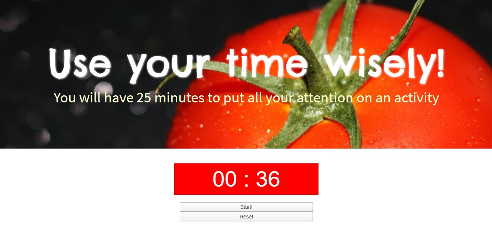

<h1> Pomodoro </h1>
Chronometer that sets an interval of 25 minutes to help people to focus on an activity. After this time, an alert suggests a break.
In this application, you can find three buttons to start, to stop and to reset the process.

<h2> Resultado </h2> 

